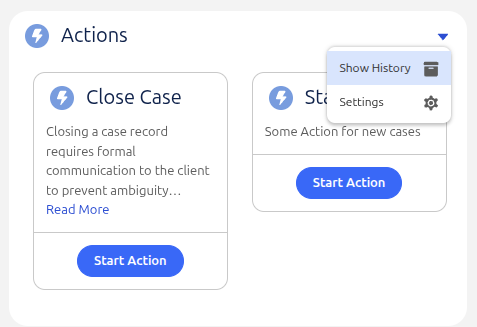

# A Library of reusable Salesforce components

A library of reusable components for the [Salesforce](https://www.salesforce.com) platform.

**Dependencies:**<br/>
This package is dependent on the following packages:
- [fflib-apex-mocks](https://github.com/apex-enterprise-patterns/fflib-apex-mocks)
- [fflib-apex-common](https://github.com/apex-enterprise-patterns/fflib-apex-common)
- [fflib-apex-extensions](https://github.com/wimvelzeboer/fflib-apex-extensions)
- [Nebula Logger](https://github.com/jongpie/NebulaLogger)
- [Salesforce Data Move Utility](https://github.com/forcedotcom/SFDX-Data-Move-Utility) 

## Installation

The package is available as an Unlocked Managed Package (2GP) with package ID `0HoJ8000000KyjkKAC`.

Either clone the repository and import the package manually, use the [Package Installation URL](https://login.salesforce.com/packaging/installPackage.apexp?p0=04tJ8000000kaPvIAI)
or execute the following SFDX CLI command in your terminal:
```bash
sf package install --package 04tJ8000000kaPvIAI --wait=10 --target-org $YOUR_ORG_ALIAS
```
_Replace `$YOUR_ORG_ALIAS` with the alias of your target org_


## Component Library
|                                                     |                                                                                                                                   |
|-----------------------------------------------------|-----------------------------------------------------------------------------------------------------------------------------------|
|  | [Record Actions](./docs/feature/record-actions.md)<br/>Listing of record specific actions which are based on configurable fomulas |
|                                                     |                                                                                                                                   |


## Usage

### Test data
Test data is available in the `data` folder, with has two subfolders:
- `database` contains test data that can be imported via the [Salesforce Data Move Utility](https://github.com/forcedotcom/SFDX-Data-Move-Utility)
- `force-app` contains metadata which is referenced by the test data

To import the test data, first make sure you have the [SFDX CLI](https://developer.salesforce.com/tools/sfdxcli) installed with the [Salesforce Data Move Utility](https://github.com/forcedotcom/SFDX-Data-Move-Utility?tab=readme-ov-file#installation-instructions) plugin.
Then deploy the metadata to your org:
```bash
sf project deploy start --source-dir ./data-packages/force-app/
```
Finally import the test data:
```bash
cd data-packages/database
sf sfdmu run --sourceusername csvfile --targetusername $ORG_ALIAS
```


## Package version log

| Package version | Package ID         | Description                    |
|-----------------|--------------------|--------------------------------|
| 0.1.0.7 | 04tJ8000000kaPvIAI | Created on 23/04/2026 07:54:50 |
