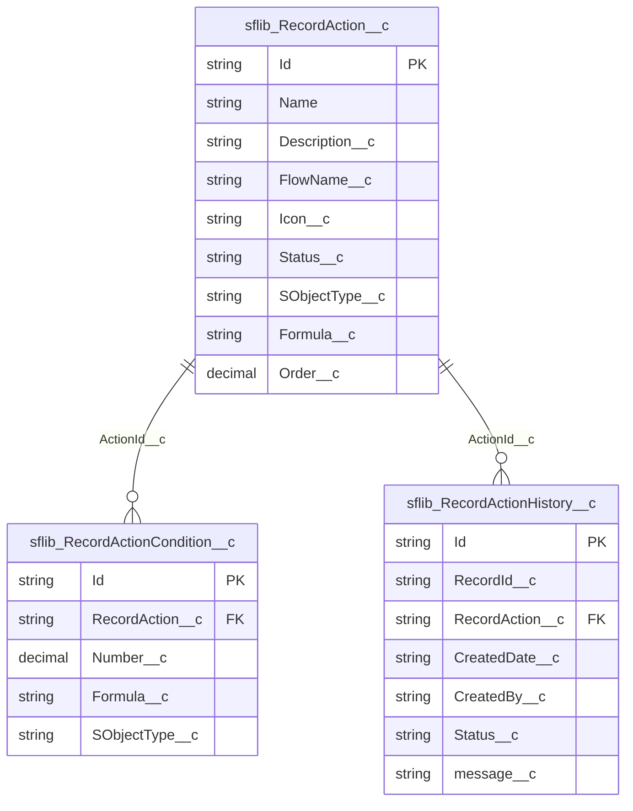

# Record Actions

The record actions feature allows you to offer a list of actions to users on a record.

A record action is an action that can be performed on a record, by invoking a screen-flow. Listed actions are filtered based on a configured set of criteria.


## Dependencies
This extension package is dependent on the following packages:
- [fflib-apex-mocks](https://github.com/apex-enterprise-patterns/fflib-apex-mocks)
- [fflib-apex-common](https://github.com/apex-enterprise-patterns/fflib-apex-common)
- [fflib-apex-extensions](https://github.com/wimvelzeboer/fflib-apex-extensions)
- [Nebula Logger](https://github.com/jongpie/NebulaLogger)

## UI components
- Record Action List
- Action Tile

### Record Action
A list of actions that meet the configured criteria.

#### Attributes
| Attribute   | Description                                                                              |
|-------------|------------------------------------------------------------------------------------------|
| `icon-name` | The name of the icon to display                                                          |
| `record-id` | The record Id for which to show the actions                                              |
| `title`     | The title of the list                                                                    |
| `variant`   | The variant type of how the component displays.<br/>Valid values include `list`, `tiles` |

#### Slots
| Slot   | Description                          |
|--------|--------------------------------------|
| header | The header above the list of actions |
| footer | The footer of the list               |

#### Examples
```html
<template>
        <sflib-record-actions
                title="Case Record Actions" 
                icon-name="custom:custom102"
                record-id={recordId}
                variant="tiles">
            <div slot="header">
                <p>Please select any of the following actions</p>
            </div>
            <div slot="footer">
                <p>
                    Can't find the action you are looking for?
                    Then please contact your System Administrator
                </p>
            </div>
        </sflib-record-actions>
    </div>
</template>
```


## Configurational options
Record actions can be configured to in the `Record Actions Setup` App.

App description: Holds the record actions, offered by the SFLib Record Action feature
Tabs:
 - Record Actions, 
   - `sflib_RecordAction__c`
   - Icon: Lightning
 - Record Action Settings
   - `sflib_RecordActionSetting__c`
   - 


- Showing actions based on a formula with conditions like
  - `1 AND 2`
  - 1: `Case.Status = 'New'`
  - 2: `Case.Priority = 'High'`
- Ordering listed actions 
- Maintaining a history log
  - using ActionHistory__c records
  - using the record's feed
- Recording the start and completion of actions


The call-to-action button starts a screen flow.

## Database Schema

| Table                            | Description                    |
|----------------------------------|--------------------------------|
| `sflib_RecordAction__c`          | The record actions             |
| `sflib_RecordActionCondition__c` | The conditions for the actions |
| `sflib_RecordActionHistory__c`   | The history of the actions     |

| Field                              | Values                                        |
|------------------------------------|-----------------------------------------------|
| `Action__c.Formula__c`             | `1 OR 2 AND 3`                                |
| `Action__c.Status`                 | `Draft`, `Active`, `Disabled`                 |
| `ActionCondition__c.Operator`      | `Equals`, `Not Equals`, `Contains`            |
| `ActionCondition__c.ObjectName__c` | `Case`, `Account`, `Contact`, `User`          |
| `ActionHistory__c.Status`          | `Started`, `Completed`, `Cancelled`, `Failed` |

## LWC Components

### Action Center Tile
- Avonni Card
    - Icon
    - Title
    - Body
        - Description
        - 'Start Action' Button

### Action Center
A list of tiles ordered by `Order__c` that meet the conditions in `Formula__c` and `ActionCondition__c`.

## Permissions
Users with the permission 'Record Action User' are able to perform the following actions:
- 'execute' Record actions and list action history
- `View` on `sflib_RecordAction__c`
- `View` on `sflib_RecordActionCondition__c`
- `View` on `sflib_RecordActionHistory__c`

Administrators with the permission 'Record Action Administrator', 
have access to the 'Record Actions Setup' App 
where they are able to perform the following actions:
- `CRUD` on `sflib_RecordAction__c` and `sflib_RecordActionCondition__c`
- `Edit` on `sflib_RecordActionHistory__c`

## Dependencies
This extension package is dependent on the following packages:
- [fflib-apex-mocks](https://github.com/apex-enterprise-patterns/fflib-apex-mocks)
- [fflib-apex-common](https://github.com/apex-enterprise-patterns/fflib-apex-common)
- [Nebula Logger](https://github.com/jongpie/NebulaLogger)
- System.FormulaEval, used to evaluate the conditions in `Formula__c`

## Limitations
- Only supports screen flows.