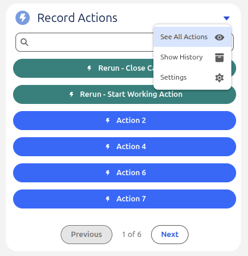
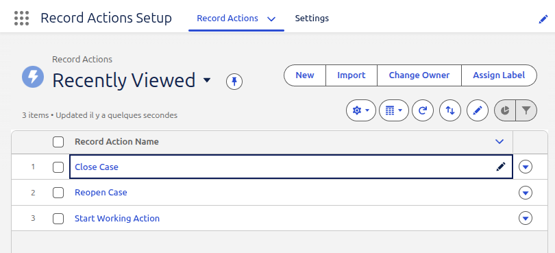
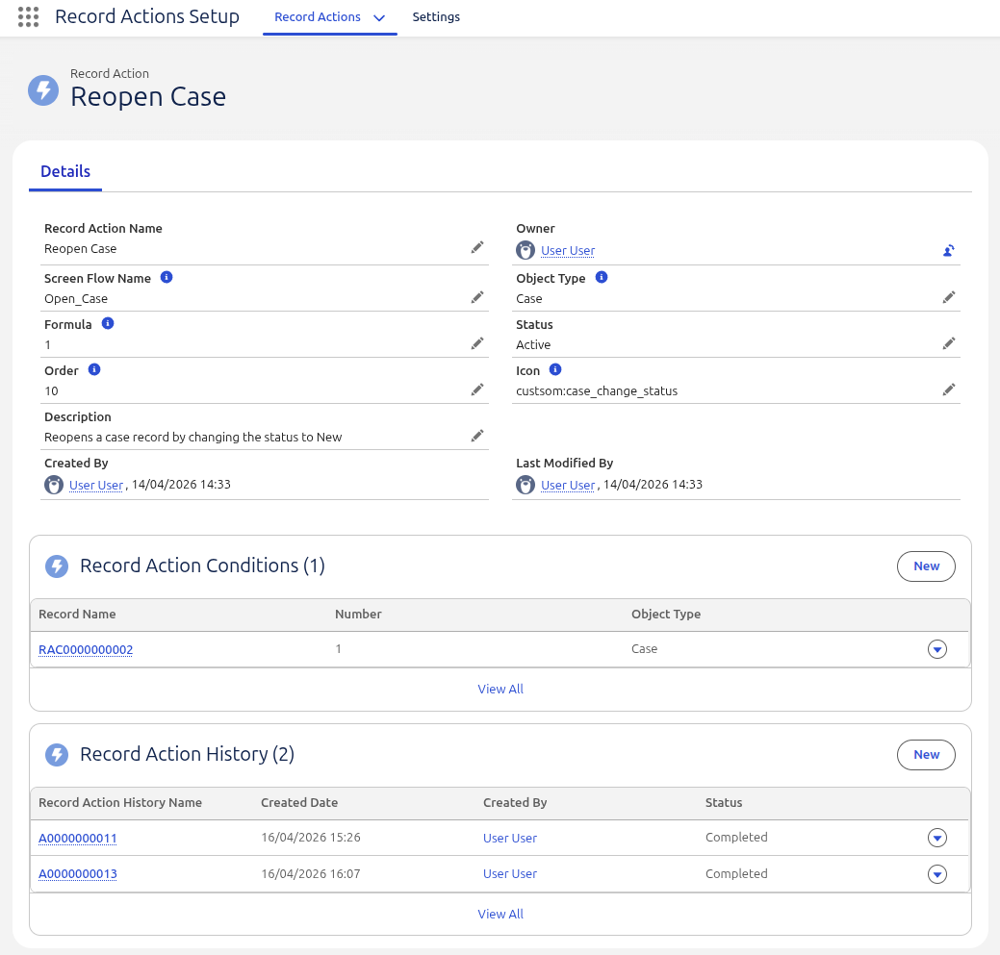
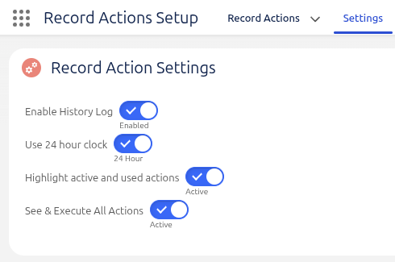
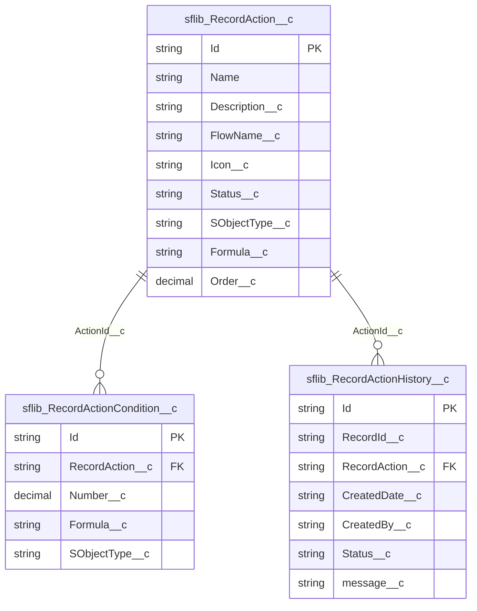

# Record Actions

The record actions feature allows you to offer a list of actions to users on a record.

A record action is an action that can be performed on a record, by invoking a screen-flow. Listed actions are filtered based on a configured set of criteria.

The actions are displayed in a list or tiles view. It can contain an action menu at the top right corner, when there are items to show (eg. history is enabled or the current user is an record action manager).




__Contents__:
- [Configurational options](#configurational-options)
- [Database Schema](#database-schema)
- [LWC Component](#lwc-components)
- [Permissions](#permissions)
- [Dependencies](#dependencies)
- [Limitations](#limitations)

## Configurational options
Record actions can be configured to in the `Record Actions Setup` App.



This app holds the record actions, offered by the SFLib Record Action feature and the record action settings.
Tabs:
 - [Record Actions](#manage-record-actions),<br/>Where actions can be configured 
 - [Record Action Settings](#manage-record-action-settings)<br/>To manage Record Action settings

### Manage Record Actions

<br/>
_Actions Detail page of the 'Record Actions Setup' Lightning App._

Showing actions based on a formula with conditions like
    - `1 AND 2`
    - 1: `Case.Status = 'New'`
    - 2: `Case.Priority = 'High'`

### Manage Record Action Settings

<br/>
_Configurable settings can be managed under the settings tab_

#### Enable History Log
When enabled, log items will be created in the `sflib_RecordActionHistory__c` object. The log includes;
- running user
- date and time when it was executed
- status of the flow
- error messages, when they occur

#### Use 24 hour clock
Lists the time in either AM/PM or military<br/>
Note: only available when the history log is enabled

#### Highlight active and used actions
Shows running and executed actions in a different color<br/>
Note: only available when the history log is enabled

#### See & Execute All Actions
Allow the user to switch between seeing only relevant record actions, based on their condition, or all record action.   
It will limit the visible actions to only list actions that match the record type and the user.

## Database Schema

| Table                            | Description                    |
|----------------------------------|--------------------------------|
| `sflib_RecordAction__c`          | The record actions             |
| `sflib_RecordActionCondition__c` | The conditions for the actions |
| `sflib_RecordActionHistory__c`   | The history of the actions     |

| Field                              | Example Values                                |
|------------------------------------|-----------------------------------------------|
| `Action__c.Formula__c`             | `1 OR 2 AND 3`                                |
| `Action__c.Status__c`              | `Draft`, `Active`, `Disabled`                 |
| `ActionCondition__c.Formula__c`    |                                               |
| `ActionCondition__c.ObjectName__c` | `Case`, `Account`, `Contact`, `User`          |
| `ActionHistory__c.Status__c`       | `Started`, `Completed`, `Cancelled`, `Failed` |


## LWC Components

### Record Action 
`c-sflib-record-actions`

A list of actions that meet the configured criteria.

__For Use In__

Lightning Experience Components, Lightning Pages, Standaline Lightning App

#### Attributes
| Attribute     | Description                                                                             | Type    | Default                           | Required |
|---------------|-----------------------------------------------------------------------------------------|---------|-----------------------------------|----------|
| `icon-name`   | The name of the icon to display                                                         | String  | `custom:custom9`                  | 
| `record-id`   | The record Id for which to show the actions                                             | String  |                                   | Yes      |
| `title`       | The title of the component                                                              | String  | `Actions`                         |
| `variant`     | The variant type of how the component displays.<br/>Valid values are `list` and `tiles` | Enum    | `list`                            |
| `show-search` | Show a search bar at the top of the component to filter the actions                     | Boolean | `false`, shows only a search icon | no       |

#### Methods
The component has no methods.

### Example
```html
<template>
    <c-sflib-record-actions
         record-id={recordId}
         variant="tiles"
    ></c-sflib-record-actions>
</template>
```


## Permissions
There are two permission sets for the Record Actions feature.
- Record Action User `sflib_RecordActionUSer`
- Record Action Administrator `sflib_RecordActionAdmin`

The user permissions set enables the following actions:
- 'execute' Record actions and list action history
- `View` on `sflib_RecordAction__c`
- `View` on `sflib_RecordActionCondition__c`
- `View` on `sflib_RecordActionHistory__c`

Administrators have access to the 'Record Actions Setup' App 
where they are able to perform the following actions:
- `CRUD` on `sflib_RecordAction__c` and `sflib_RecordActionCondition__c`
- `Edit` on `sflib_RecordActionHistory__c`
- `Edit` on settings (using the Settings Tab) 

## Dependencies
This extension package is dependent on the following packages:
- [fflib-apex-mocks](https://github.com/apex-enterprise-patterns/fflib-apex-mocks)
- [fflib-apex-common](https://github.com/apex-enterprise-patterns/fflib-apex-common)
- [fflib-apex-extensions](https://github.com/wimvelzeboer/fflib-apex-extensions)
- System.FormulaEval, used to evaluate the conditions in `Formula__c`

## Limitations
- Only supports screen flows.